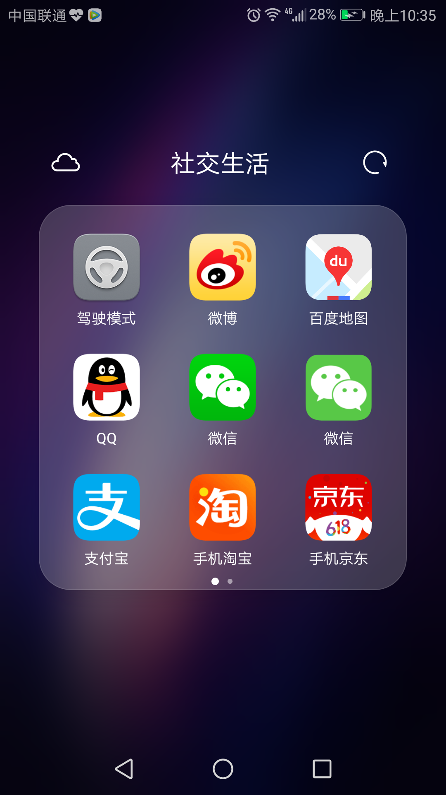
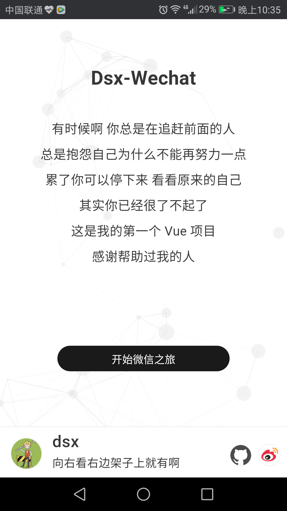

# Dsx_wechat By Vue 2.0

* 这是一个 Vue 仿微信客户端
* Github项目地址：[https://github.com/Werb/Pixel-Web](https://github.com/Werb/Pixel-Web)
* 一款模仿微信的 Web App，具有真实的聊天等功能，并采用前后端分离的方式来实现。前端基于 Vue 2.0 框架，[后端](https://github.com/moohng/wchat-sv)基于 Node.js + Express + MongoDB，聊天功能和添加好友功能通过 Websocket 实现。
* 欢迎关注我的公众号：

> 前端技术栈: vue 2.0、vue-cli、vuex、vue-router、webpack 2.x、pug、sass、babel等；

> 后端技术栈：Node.js、Express、express-session、WebSocket(ws)、MongoDB、mongoose、ES6等。

### Tips
* 无法访问此网站是因为需要在微博开放平台注册应用，我填的回调地址是我本机的ip的原因
* 所以你需要先去微博注册一个应用
* 注册我选择的是 微连接 - 网页应用 
* 创建成功后保存 App Key 和 App Secret
* 然后在控制台-应用信息-高级信息设置 OAuth2.0 授权回调页，用于我们在登录后回调到我们的网页中，即[api-config.js](./src/api/config/api-config.js)所配置的内容
* [Pixel-Api](https://github.com/Werb/Pixel-Api) 服务器我已经部署到了 Heroku
* 在线 Server 地址 [https://pixel-api.herokuapp.com/](https://pixel-api.herokuapp.com/)

### Intro
* 我是一个前端小白，突发奇想自学 Vue ，前前后后写了一个月时间
* 使用 vue-cli 构建、打包, 配合 vue全家桶（vue、vuex、vue-router）进行编码
* 使用 axios 进行资源请求
* 使用 Node.js 对 api 进行二次封装解决跨域问题

### Server
* 使用 Nodejs + Express 开发
* 实现 Oauth登录，查看最新微博，查看单条微博评论，个人主页，我的关注，我的粉丝，发微博以及四种消息（@我的微博，@我的评论，收到的评论，发出的评论）
* Github项目地址：[https://github.com/Werb/Pixel-Api](https://github.com/Werb/Pixel-Api)

### Preview




## 在线预览

[点击这里在线查看效果](http://mohng.com/wchat-vue)，建议使用谷歌浏览器，并开启手机调试模式（由于项目仍在开发中，部分功能可能不是最新、或暂不可用）。

新用户必须通过注册账号进入，已注册用户可直接登录进入。目前占不支持离线消息，也不支持添加离线用户为好友（即时通信相关功能必须保证对方在线）

## 本地使用

假设你已安装 `Node.js`，那么直接克隆仓库到本地，安装完所有插件并启动服务器。
建议使用谷歌浏览器并在手机调试模式下查看(http://localhost:8808/)。

``` bash
# clone
git clone https://github.com/moohng/wchat-vue.git

# 进入到目录 安装所有依赖包 国内建议使用cnpm
cd wchat-vue
npm install

# 开启本地服务器 监听8808端口
npm run dev
```

## 功能说明

该项目已实现后端服务器的支持，具有真实的聊天功能。后端部分请转移[这里](https://github.com/moohng/wchat-sv)

- 高仿iOS端的界面设计风格，具有push、pop、modal、dismiss等转场动画；
- 注册、登陆和注销功能，可记住登录状态，避免多次登录；
- 聊天室功能，所有在线用户可进行群聊；
- 添加好友，目前必须保证对方在线才能正确添加；
- 用户私聊，目前必须保证对方在线方可正常聊天；
- 目前只支持纯文本聊天。

更多功能请待续...


如果您觉得该项目不错, 欢迎**star**和分享！

### LICENSE
[Apache License](./LICENSE)
